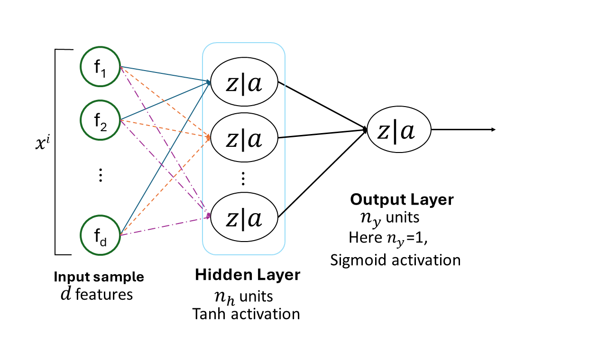
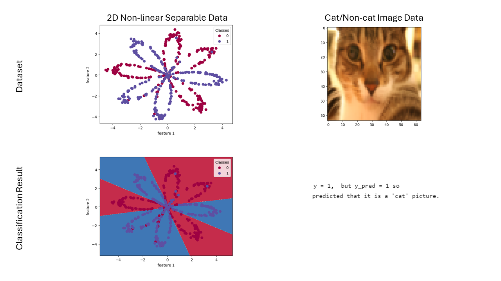
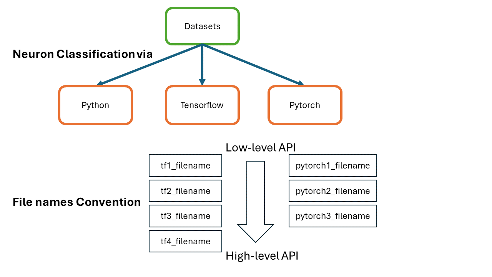

# p004-neural-network-1-hidden-layer
Classification is done by 1 hidden layer neural network; implemented in vanilla python, tensorflow and pytorch. In tensorflow/pytorch, different APIs are explored to implement same algorithm.
 
Blow figure describes the hidden layer neural network architure that is implemented:
 

 
Two datasets are used: 2D nonlinear separable and cat/non-cat images.
 

 
 
Directories are named after these datasets. Within each directory of dataset, neuron algorithm is implemented in three ways i.e; vanilla python, pytorch and tensorflow. Pytorch and tensorflow have low-level and high-level APIs. So there are different ways and styles to implement using frameworks. File convention of wxploring different ways is described in picture below:
 

